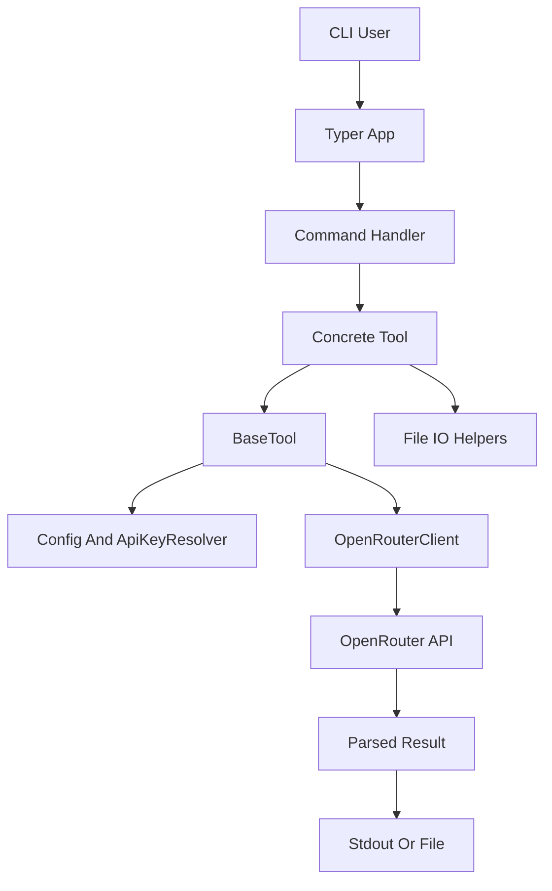

# AI CLI Tool Implementation Plan

## 前提と方針

- 参照API仕様は [documents/how_to_use-LLMAPI.md](documents/how_to_use-LLMAPI.md) を主に使い、TTSの補足として [documents/tts.md](documents/tts.md) を参照します。
- 現状は [pyproject.toml](pyproject.toml) と [main.py](main.py) だけの最小構成なので、実装時に `src/aitool/` 配下へパッケージ化します。
- 配布パッケージ名は既存の `aitool-iroiro` を維持し、CLIコマンド名だけ `aitool` にします。`uv tool install git+...` と `uvx --from git+... aitool ...` の両方で使えるよう、`[project.scripts] aitool = "aitool.cli:app"` を設定します。
- HTTP通信は `httpx`、CLIは `typer`、`.env` 読み込みは軽量に自前実装または `python-dotenv` を使います。開発効率を優先するなら `python-dotenv` を依存に追加するのが無難です。

## 推奨CLI仕様

- 共通オプション:
  - `--api-key`: 明示指定。最優先で使用します。
  - `--model`: モデル上書き。
  - `--timeout`: HTTPタイムアウト秒。既定は `120`。
  - `--json`: レスポンスメタ情報をJSONで出力。デバッグ・自動化向け。
  - `--verbose`: リクエスト先、モデル、生成IDなどをstderrへ出力。
- APIキー解決順:
  - `--api-key`
  - カレントディレクトリの `.env` の `OPENROUTER_API_KEY`
  - `~/.env.global` の `OPENROUTER_API_KEY`
  - 環境変数 `OPENROUTER_API_KEY` も実用上は読むのが望ましいです。要件の順序を厳密にするなら `.env` 系の後にします。
- 既定モデルの解決順:
  - コマンドの `--model`
  - カレントディレクトリの `.env` の機能別モデル変数
  - `~/.env.global` の機能別モデル変数
  - `models.py` のコード内定数
  - 機能別モデル変数は `AITOOL_IMAGE_GENERATION_MODEL`, `AITOOL_IMAGE_RECOGNITION_MODEL`, `AITOOL_STT_MODEL`, `AITOOL_TTS_MODEL` とします。
  - コード内定数は「ライブラリとしての安全な既定値」、envは「利用者ごとの差し替え」、CLI引数は「一回だけの上書き」と役割を分けます。
- 画像生成:
  - `aitool generate-image --text "..." --image ./a.png --image ./b.jpg --output ./generated.png`
  - `--text` は必須、`--image` は複数指定可。画像未指定ならt2i、指定ありならi2iとして扱います。
  - `--aspect-ratio`, `--image-size`, `--output`, `--model` を受け付けます。
  - 既定モデル候補は `google/gemini-3.1-flash-image-preview`。
- 画像認識:
  - `aitool recognize-image --text "この画像を説明して" --image ./a.png --image ./b.webp`
  - `--text` と `--image` は必須。結果は標準出力へ出し、`--output result.txt` 指定時はファイル保存します。
  - 既定モデル候補は `google/gemini-2.5-flash` または `openai/gpt-4.1-mini`。
- STT:
  - `aitool transcribe --audio ./voice.mp3`
  - `aitool transcribe --audio ./voice.mp3 --output ./transcript.txt`
  - 既定は専用エンドポイント `/audio/transcriptions` を使います。`--format` は拡張子から推定し、必要なら明示指定できます。
  - 画像認識と同じく、`--output` 未指定時は文字起こし結果を標準出力へ出し、指定時はファイルへ保存します。
  - `--prompt` を受け付けたい場合は、`--mode dedicated|llm` を追加し、`llm` の時だけチャット補完の `input_audio` 形式でプロンプト付き文字起こしを行います。
  - 既定モデル候補は `openai/whisper-large-v3-turbo`。
- TTS:
  - `aitool tts --text "こんにちは" --output ./voice.mp3 --voice alloy --format mp3`
  - `--text`, `--output`, `--voice`, `--format`, `--speed`, `--model` を受け付けます。
  - 既定モデル候補は `openai/gpt-4o-mini-tts-2025-12-15`、既定voiceは `alloy`、既定formatは扱いやすさ優先で `mp3`。

## 推奨ファイル構成

```text
src/aitool/
  __init__.py
  cli.py
  config.py
  errors.py
  io.py
  models.py
  openrouter.py
  tools/
    __init__.py
    base.py
    image_generation.py
    image_recognition.py
    stt.py
    tts.py
tests/
  test_config.py
  test_io.py
  test_payloads.py
README.md
```

## 設計



- `OpenRouterClient` はエンドポイントごとの低レベルHTTPを担当します。
  - `chat_completions(payload) -> dict`
  - `audio_transcriptions(payload) -> dict`
  - `audio_speech(payload) -> tuple[bytes, headers]`
- `BaseTool` は設定、APIキー、HTTPクライアント、共通バリデーションを持ちます。
  - `run()` を抽象メソッドにします。
  - 各ツールは「CLI引数をドメイン入力へ変換」「OpenRouter payloadを構築」「結果を保存/表示」に集中します。
- `io.py` はファイル処理を共通化します。
  - 画像・音声の存在確認
  - MIME type / audio format 推定
  - Base64 data URL生成
  - data URLから画像バイト抽出
  - 出力先ディレクトリの存在確認
- `models.py` は既定モデルと許可値を集約します。
  - モデル名はAPI側で変わりやすいので、厳格な固定リストではなく「コード内定数 + env上書き + CLI上書き」を基本にします。
  - `config.py` が機能名から対応するenv変数を解決し、未指定時だけ `models.py` の既定値へフォールバックします。

## API実装メモ

- 画像認識は `/chat/completions` へ、`content: [{type: "text"}, {type: "image_url"}]` の配列を送ります。
- 画像生成は `/chat/completions` へ、`modalities: ["image", "text"]` と `image_config` を付け、レスポンスの `choices[0].message.images[0].image_url.url` を保存します。
- STTの既定実装は `/audio/transcriptions` へ、`input_audio: { data: base64, format }` を送ります。
- STTの `--mode llm` は `/chat/completions` へ、`content: [{type: "text"}, {type: "input_audio"}]` を送る拡張として実装します。
- TTSは `/audio/speech` へJSONを送り、レスポンス本文をバイト列として保存します。エラー時はJSON本文を読んでCLIエラーに変換します。

## 実装順序

1. `pyproject.toml` をCLIパッケージ用に更新します。
   - `httpx`, `typer`, 必要なら `python-dotenv`, テスト用に `pytest`, `respx` または `pytest-httpx` を追加します。
   - `[project.scripts]` に `aitool` を追加します。
2. `src/aitool/` に共通基盤を実装します。
   - `config.py`: APIキー解決、機能別モデル解決、既定値、環境ファイル読み込み。
   - `openrouter.py`: `httpx.Client` / `httpx.AsyncClient` の薄いラッパー。
   - `io.py`: Base64化、MIME推定、保存処理。
   - `errors.py`: ユーザー向け例外とHTTPエラー整形。
3. `tools/base.py` と各具体ツールを実装します。
   - 画像生成、画像認識、STT、TTSを別ファイルに分けます。
   - 各ツールのpayload生成はテストしやすい純粋関数に寄せます。
4. `cli.py` でTyperコマンドを定義します。
   - CLI層では引数定義、エラーハンドリング、stdout/stderr整形だけを行います。
   - 各コマンドは対応ツールクラスに処理を委譲します。
5. テストを追加します。
   - APIキー解決順。
   - 機能別モデルの解決順。
   - 画像/音声のBase64変換と拡張子推定。
   - 各コマンドのpayload生成。
   - HTTP成功/失敗時のパース。
   - Typerの `CliRunner` による主要コマンドの引数検証。
6. READMEを整備します。
   - インストール例: `uv tool install git+...`
   - uvx例: `uvx --from git+... aitool tts ...`
   - `.env` / `~/.env.global` のAPIキーと機能別モデル上書きの書き方。
   - 4機能の実行例。

## 注意点と判断事項

- `STT` は要件に「テキストとファイル」とありますが、専用STTエンドポイントでは基本的に音声のみです。プロンプト付きSTTを重視するなら、`--mode llm` を正式機能として入れる設計がよいです。
- STTの出力は画像認識と同じ規則に統一し、標準出力または `--output` 保存にします。`--json` は本文出力ではなくメタ情報出力に限定します。
- `response_format` の `json` オプションは、画像や音声ファイル保存と衝突しないよう、メタ情報出力に限定するのが安全です。
- OpenRouterのモデル名・対応モダリティは変わりやすいため、将来は `aitool models --modality image|speech|audio-input` のような探索コマンドを追加できる設計にしておくと拡張しやすいです。
- 初期実装ではストリーミングは不要です。TTSもまずは全量受信して保存し、必要になったらストリーム保存を追加します。